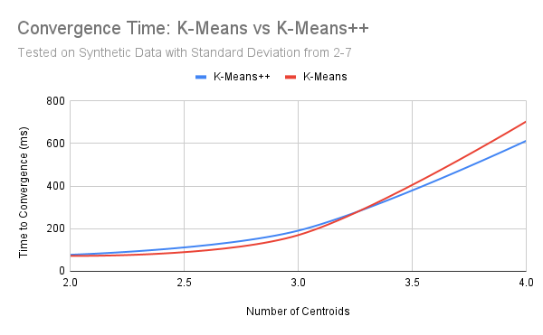

# Analysis of K-Means vs K-Means++

For my individual deep dive project I chose to benchmark the performance of K-Means and K-Means++
clustering algorithms. The metrics I chose to compare these two clustering algorithms were the
time it took for each of these algorithms to achieve convergence for the same dataset and the 
Sum of Squared Errors (SSE) of each of the final clusters. I chose to make synthetic datasets
to compare these algorithms by pre-defining "true" centroids and dispersing a defined amount
of points around that centroid using random Gaussian Distribution. This approach allowed me 
to create "easier" and "harder" datasets by changing the standard deviation of the distributions
around the centroids, creating more/less distinct clusters. 

## Results

The following tables were extracted from the output created by running the main function
in "Main.kt". This is the only file you should need to run to simulate these 
clustering algorithms. A plot has also been included for ease of reading. 

### K-Means Benchmark: Round 1

| k | stdDev | K-means++ Time (ms) | K-means++ SSE | Random Init Time (ms) | Random Init SSE |
|:---|:---|---:|---:|---:|---:|
| 2 | 1.0 | 81 | 35511.80218146413 | 23 | 35511.802275438975 |
| 2 | 2.0 | 112 | 111758.77553310285 | 85 | 111758.77553310285 |
| 2 | 3.0 | 31 | 256006.1236845045 | 89 | 256005.99579551883 |
| 2 | 4.0 | 174 | 438604.05569207156 | 115 | 438606.5399799144 |
| 2 | 5.0 | 97 | 708064.0965346226 | 97 | 708064.0965346226 |
| 2 | 6.0 | 39 | 988609.1817551096 | 165 | 988609.1817551096 |
| 2 | 7.0 | 145 | 1382347.6154437864 | 83 | 1382330.0565901136 |
| 3 | 1.0 | 17 | 59656.720608576055 | 13 | 59656.720608576055 |
| 3 | 2.0 | 162 | 177495.920881663 | 92 | 177495.65711909012 |
| 3 | 3.0 | 204 | 377073.41057172464 | 115 | 377077.5236315634 |
| 3 | 4.0 | 163 | 635246.5292681602 | 99 | 635246.5292681602 |
| 3 | 5.0 | 122 | 829307.316307822 | 214 | 829307.316307822 |
| 3 | 6.0 | 312 | 1039260.3794143841 | 399 | 1039687.7826302536 |
| 3 | 7.0 | 92 | 1510967.2208410436 | 94 | 1510518.2331995533 |
| 4 | 1.0 | 110 | 65705.25485678951 | 128 | 65705.25292521974 |
| 4 | 2.0 | 242 | 137631.0767250306 | 430 | 138124.66703762076 |
| 4 | 3.0 | 287 | 411018.98458935815 | 489 | 415597.14114098286 |
| 4 | 4.0 | 1517 | 619308.2488599 | 1884 | 619308.2488599 |
| 4 | 5.0 | 1477 | 892793.842725395 | 1184 | 892793.842725395 |
| 4 | 6.0 | 608 | 1193438.4004037725 | 376 | 1193438.4112518637 |
| 4 | 7.0 | 138 | 1654431.8586411576 | 1008 | 1649517.7440581047 |

### K-Means Benchmark: Round 2

| k | stdDev | K-means++ Time (ms) | K-means++ SSE | Random Init Time (ms) | Random Init SSE |
|:---|:---|---:|---:|---:|---:|
| 2 | 1.0 | 29 | 31601.065194512357 | 40 | 31601.07565891432 |
| 2 | 2.0 | 37 | 121557.15901410823 | 26 | 121557.15901410823 |
| 2 | 3.0 | 16 | 317930.7846300224 | 23 | 317930.7846300224 |
| 2 | 4.0 | 44 | 464057.86630762427 | 41 | 464057.86630762427 |
| 2 | 5.0 | 101 | 705967.7746358851 | 75 | 705967.5017948914 |
| 2 | 6.0 | 31 | 1079886.0675117334 | 23 | 1079886.1300963466 |
| 2 | 7.0 | 150 | 1358906.2770665446 | 131 | 1358906.2770665446 |
| 3 | 1.0 | 250 | 45301.750252755024 | 161 | 45301.751719108506 |
| 3 | 2.0 | 135 | 156110.91542914664 | 102 | 156110.91717924125 |
| 3 | 3.0 | 67 | 344971.7619873227 | 106 | 344971.8164252556 |
| 3 | 4.0 | 231 | 556098.3247914119 | 118 | 556098.3247914119 |
| 3 | 5.0 | 296 | 886455.2703567703 | 256 | 886455.2703567703 |
| 3 | 6.0 | 486 | 1078934.8483768625 | 268 | 1078934.8483768625 |
| 3 | 7.0 | 134 | 1463811.8372779791 | 340 | 1463805.569917919 |
| 4 | 1.0 | 203 | 68034.17520868966 | 179 | 68034.17520868966 |
| 4 | 2.0 | 642 | 225112.50730727284 | 251 | 225112.07188476436 |
| 4 | 3.0 | 532 | 383298.2773871704 | 274 | 383298.2773871704 |
| 4 | 4.0 | 450 | 631799.0523333218 | 349 | 631799.0523333218 |
| 4 | 5.0 | 898 | 893174.7919930479 | 695 | 893174.7919930479 |
| 4 | 6.0 | 1258 | 1115212.2085504613 | 1661 | 1115212.2085504613 |
| 4 | 7.0 | 218 | 1535565.7793684443 | 941 | 1533113.6801502833 |

(Note: These plots take the average of the convergence times/SSE values across different
centroid values and across different standard deviation values. This allows us to see the
overall trends cleanly.)

From the plots above we can conclude that, for the synthetically-produced datasets, the clustering
algorithms' performances are relatively similar, with K-Means++ slightly outperforming K-Means
in the time it took to achieve convergence. 

## Discussion and Conclusion

I believe that the root cause of the closeness in performance between K-Means and K-Means++ 
for my synthetic data was its size. Had I generated data with hundreds of thousands of data
points or hundreds of centroids I believe that the SSE values and the Convergence Times would
be significantly more different between K-Means and K-Means++, with K-Means++ performing better.
In the raw data this pattern can already be seen, where in some iterations K-Means takes 
significantly longer to converge than K-Means++, and with a higher SSE value (indicating worse
accuracy). The reasoning behind using K-Means++ lies precisely in that capability: it is able
to reach convergence faster with more consistent results, while K-Means can get stuck in poor
cluster formations if the initialization conditions are suboptimal. 